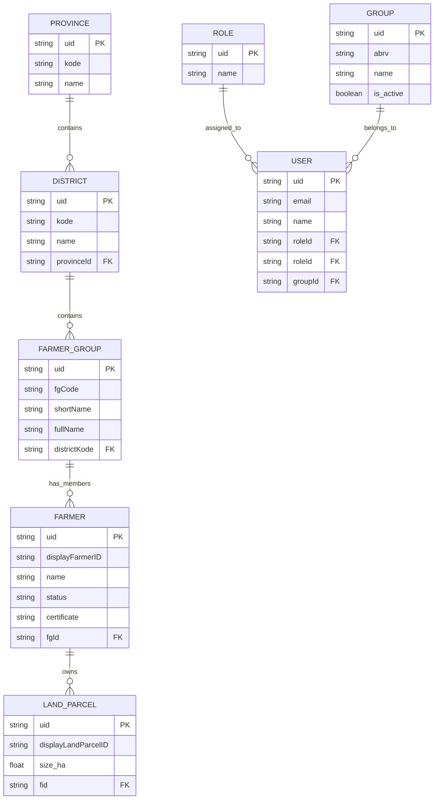

# Database Schema

## Core Tables

### Province (`tbl-province`)
- `id`: Int (Autoincrement, PK)
- `uid`: String (UUID, Unique)
- `kode`: String (Unique) - Administrative code
- `name`: String
- `districts`: Relation to District[]

### District (`tbl-district`)
- `id`: Int (Autoincrement, PK)
- `uid`: String (UUID, Unique)
- `kode`: String (Unique) - Administrative code
- `name`: String
- `provinceId`: String (FK -> Province.uid)
- `province`: Relation to Province
- `farmerGroups`: Relation to FarmerGroup[]

### Group (`tbl-group`)
- `id`: Int (Autoincrement, PK)
- `uid`: String (UUID, Unique)
- `abrv`: String (Unique) - Abbreviation
- `name`: String
- `is_active`: Boolean
- `users`: Relation to User[]

### Farmer Group (`tbl-farmer-group`)
- `id`: Int (Autoincrement, PK)
- `uid`: String (UUID, Unique)
- `fgCode`: String (Unique) - Farmer Group Code/Slug
- `abrv`: String
- `shortName`: String
- `fullName`: String
- `districtKode`: String (FK -> District.kode)
- `district`: Relation to District

### Role (`tbl-role`)
- `id`: Int (Autoincrement, PK)
- `uid`: String (UUID, Unique)
- `name`: String (Unique)
- `users`: Relation to User[]

### User (`tbl-user`)
- `id`: Int (Autoincrement, PK)
- `uid`: String (UUID, Unique)
- `email`: String (Unique)
- `name`: String
- `password`: String
- `roleId`: String (FK -> Role.uid)
- `role`: Relation to Role
- `group`: Relation to Group?

### Farmer (`tbl-farmer`)

- `id`: Int (Autoincrement, PK)
- `uid`: String (UUID, Unique)
- `fgId`: String (FK -> FarmerGroup.uid)
- `displayFarmerID`: String (Unique)
- `name`: String
- `status`: String (Registered, Reserved, inActive)
- `certificate`: String? (Comma-separated or Single Value)
- `farmerGroup`: Relation to FarmerGroup
- `landParcels`: Relation to LandParcel[]

### Land Parcel (`tbl-land-parcel`)

- `id`: Int (Autoincrement, PK)
- `uid`: String (UUID, Unique)
- `fid`: String (FK -> Farmer.uid)
- `displayLandParcelID`: String
- `fg_name`: String
- `polygon`: Unsupported (Geometry)
- `size_ha`: Float
- `revision`: Int
- `farmer`: Relation to Farmer

## Entity Relationship Diagram

